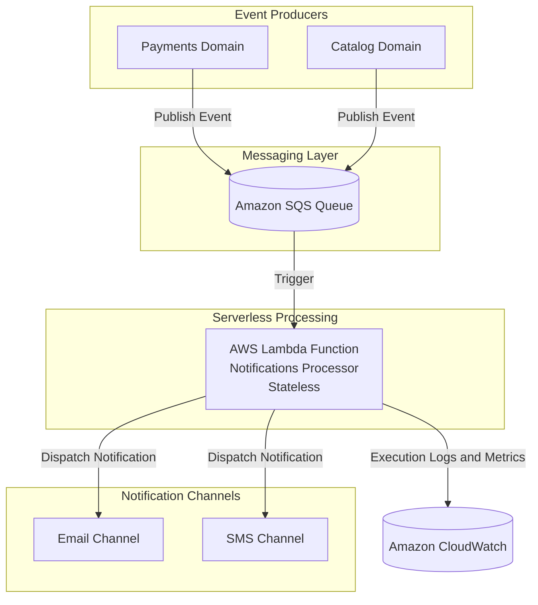
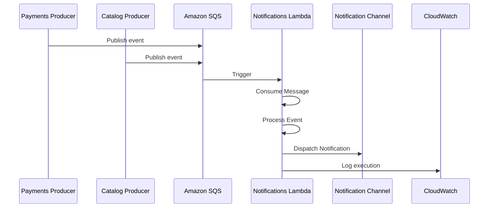

# FIAP Cloud Games - Notifications (Fase 4)

Microsserviço de notificações orientado a eventos, implementado como processador serverless em AWS Lambda.

Este serviço não expõe API pública. Ele reage a eventos publicados por outros domínios do ecossistema FIAP Cloud Games, consome mensagens via Amazon SQS, processa o evento e despacha notificações para canais como e-mail e SMS.

## Arquitetura AWS (Fase 4)

A arquitetura deste repositório é focada em execução sob demanda e desacoplamento por mensageria.

- Runtime principal: AWS Lambda
- Fonte de eventos: Amazon SQS
- Observabilidade: Amazon CloudWatch
- Provisionamento de infraestrutura: Terraform
- Empacotamento e publicação: fluxo AWS para artefatos de execução serverless

Esse desenho reforça um modelo event-driven serverless:

- Sem servidor dedicado em execução contínua
- Sem endpoint HTTP de negócio
- Escalabilidade automática por volume de mensagens
- Processamento assíncrono com baixo acoplamento entre produtores e consumidor

## Diagrama de Arquitetura



## Fluxo de Processamento de Eventos



## Responsabilidades

- Consumir eventos assíncronos a partir da fila SQS de notificações
- Normalizar e desserializar payloads de eventos
- Resolver o tipo de evento e executar o handler correspondente
- Despachar notificações para os canais suportados
- Registrar logs, falhas e contexto de processamento no CloudWatch
- Aplicar estratégia de falha por mensagem para permitir nova tentativa conforme política da fila

## Pipeline de Processamento

Pipeline interno da função Lambda em cada invocação:

1. Trigger por lote de mensagens recebido da fila SQS.
2. Leitura das mensagens e parsing do envelope do evento.
3. Validação de estrutura mínima: tipo do evento e payload.
4. Roteamento para o dispatcher de eventos.
5. Execução do handler específico de domínio.
6. Dispatch Notification para o canal apropriado.
7. Emissão de logs técnicos e de negócio no CloudWatch.
8. Em caso de erro, marcação de falha para reprocessamento segundo política da fila.

Características operacionais do runtime:

- Stateless por invocação
- Event-driven por design
- Sem API pública
- Escala horizontal automática por volume de mensagens

## Execução Local

Execução local é aplicável para validação de código e testes de processamento com eventos simulados.

Pré-requisitos:

- .NET 10 SDK
- AWS Toolkit para Lambda CLI, quando aplicável
- Credenciais AWS válidas para recursos utilizados em integração

Comandos úteis:

```bash
dotnet restore
dotnet build cloud-games-fase-4-notifications.sln
```

Para testes locais da função, utilize eventos SQS simulados e execute a Lambda com ferramentas de desenvolvimento AWS compatíveis com o projeto.

## Deploy AWS

Fluxo recomendado de deploy:

1. Build do projeto da função em modo Release.
2. Empacotamento do artefato da Lambda.
3. Provisionamento ou atualização de infraestrutura via Terraform.
4. Publicação da função e associação da fila SQS como trigger.
5. Validação pós-deploy em CloudWatch Logs.

Diretrizes de implantação:

- Garantir permissões IAM para consumo da fila e escrita de logs
- Configurar timeout e memória conforme perfil de carga
- Validar políticas de retry e dead-letter queue no ambiente

## Estrutura de Pastas

```text
.
+-- functions/
¦   +-- NotificationLambda/
¦       +-- Function.cs
¦       +-- aws-lambda-tools-defaults.json
¦       +-- Handlers/
¦       +-- Messages/
¦       +-- Services/
+-- src/
¦   +-- Fiap.CloudGames.Application/
¦   +-- Fiap.CloudGames.Domain/
¦   +-- Fiap.CloudGames.Infrastructure/
¦   +-- Fiap.CloudGames.Worker/
+-- tests/
¦   +-- Fiap.CloudGames.Tests/
+-- cloud-games-fase-4-notifications.sln
+-- Dockerfile
+-- README.md
```

## Tecnologias

- .NET 10
- AWS Lambda
- Amazon SQS
- Amazon CloudWatch
- AWS SDK for .NET
- Serilog
- Terraform

## Variáveis de Ambiente

Variáveis recomendadas para execução e deploy:

| Variável | Obrigatória | Descrição |
|---|---|---|
| MAIN_SQS_QUEUE_URL | Sim | URL da fila SQS consumida pela função |
| AWS_REGION | Sim | Região AWS de execução dos recursos |
| AWS_ACCESS_KEY_ID | Condicional | Credencial para execução fora de ambiente com role anexada |
| AWS_SECRET_ACCESS_KEY | Condicional | Segredo da credencial associada |
| AWS_SESSION_TOKEN | Condicional | Token temporário quando uso de credencial de sessão |
| ASPNETCORE_ENVIRONMENT | Não | Ambiente de execução da aplicação |

Observações:

- Em ambiente AWS com role da função, prefira credenciais gerenciadas em vez de variáveis estáticas.
- Defina políticas de acesso mínimo necessário para SQS e CloudWatch.

## Repositórios Relacionados

- Orquestração e infraestrutura da Fase 4
  - https://github.com/FIAP-10NETT-Grupo-30/cloud-games-fase-4-orchestration-aws
- Serviço de usuários
  - https://github.com/FIAP-10NETT-Grupo-30/cloud-games-fase-4-users
- Serviço de catálogo
  - https://github.com/FIAP-10NETT-Grupo-30/cloud-games-fase-4-catalog
- Serviço de pagamentos
  - https://github.com/FIAP-10NETT-Grupo-30/cloud-games-fase-4-payments
