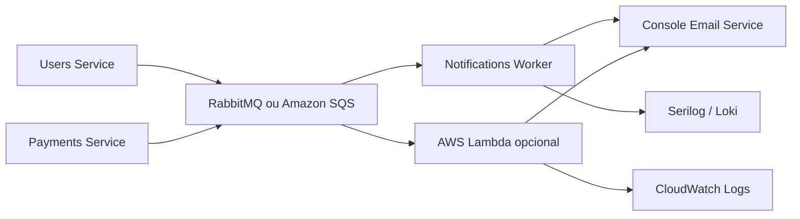

# FIAP Cloud Games - Notifications (Fase 4)

Microsserviço responsável por consumir eventos dos domínios de usuários e pagamentos e gerar notificações. O envio de e-mail é representado por uma implementação em console, permitindo validar o fluxo sem depender de um provedor externo.

## Arquitetura

O runtime principal é um Worker em .NET 10, empacotado em Docker e preparado para execução no Amazon EKS. A mensageria pode ser configurada de duas formas:

- RabbitMQ com MassTransit, usado na execução local e no fluxo principal em Kubernetes.
- Amazon SQS, consumido pelo próprio Worker quando `MESSAGING_PROVIDER=SQS`.

O repositório também contém um handler AWS Lambda opcional para consumir diretamente eventos do SQS. Tanto o Worker quanto a Lambda fazem parte da solution e são validados pelo pipeline de CI.


```mermaid
flowchart LR
    Users[Users Service] --> Broker[RabbitMQ ou Amazon SQS]
    Payments[Payments Service] --> Broker
    Broker --> Worker[Notifications Worker]
    Broker --> Lambda[AWS Lambda opcional]
    Worker --> Email[Console Email Service]
    Lambda --> Email
    Worker --> Logs[Serilog / Loki]
    Lambda --> CloudWatch[CloudWatch Logs]
```

## Responsabilidades

- Consumir eventos assíncronos de usuários e pagamentos.
- Desserializar e encaminhar cada evento ao handler correspondente.
- Gerar o conteúdo da notificação.
- Registrar o processamento com correlação e contexto do tenant.
- Permitir processamento por RabbitMQ ou SQS sem alterar os contratos de domínio.

Eventos tratados incluem:

- `UserSignedUpEvent`
- `UserEmailConfirmedEvent`
- `UserInvitedEvent`
- `UserForgotPasswordEvent`
- `UserPasswordResetedEvent`
- `PaymentLinkGeneratedEvent`
- `PaymentSucceededEvent`
- `PaymentRefundedEvent`
- `PaymentFailedEvent`

## Execução local

### Pré-requisitos

- .NET 10 SDK
- RabbitMQ
- Loki, opcional para centralização dos logs

A infraestrutura local pode ser iniciada pelo [repositório de orquestração](https://github.com/louresb/cloud-games-fase-4-orchestration-aws):

```bash
docker compose -f docker-compose.fase4.yaml up -d
```

No repositório do Notifications:

```bash
dotnet restore
dotnet run --project src/Fiap.CloudGames.Worker
```

Health checks:

- `GET /health/live`
- `GET /health/ready`

## Processamento com Amazon SQS

Para executar o Worker no modo SQS:

```text
MESSAGING_PROVIDER=SQS
MAIN_SQS_QUEUE_URL=https://sqs.us-east-1.amazonaws.com/123456789012/notifications
AWS_REGION=us-east-1
```

Em ambiente AWS, as credenciais devem ser fornecidas por IAM Role. Credenciais explícitas são necessárias apenas em ambientes locais que não possuam uma role associada.

O handler alternativo em `functions/NotificationLambda` recebe eventos `SQSEvent` e usa os mesmos contratos e serviços de aplicação:

```bash
dotnet build functions/NotificationLambda/NotificationLambda.csproj
```

## Deploy

O workflow `.github/workflows/deploy.yml` realiza build, testes, criação da imagem Docker e publicação no Amazon ECR. O deploy no Amazon EKS é opcional e controlado pela variável `ENABLE_EKS_DEPLOY`.

A infraestrutura compartilhada e os manifests de execução estão documentados no [repositório de orquestração](https://github.com/louresb/cloud-games-fase-4-orchestration-aws).

## Estrutura de pastas

```text
.
|-- functions/
|   `-- NotificationLambda/
|-- src/
|   |-- Fiap.CloudGames.Application/
|   |-- Fiap.CloudGames.Domain/
|   |-- Fiap.CloudGames.Infrastructure/
|   `-- Fiap.CloudGames.Worker/
|-- tests/
|   `-- Fiap.CloudGames.Tests/
|-- k8s/
|-- Dockerfile
`-- cloud-games-fase-4-notifications.sln
```

## Tecnologias

- .NET 10
- RabbitMQ e MassTransit
- Amazon SQS e AWS Lambda
- Docker e Kubernetes
- Amazon ECR e EKS
- Serilog e Grafana Loki

## Variáveis de ambiente

| Variável | Uso |
|---|---|
| `MESSAGING_PROVIDER` | `RabbitMQ` por padrão ou `SQS` |
| `RabbitMq__HostName` | Host do RabbitMQ |
| `RabbitMq__UserName` | Usuário do RabbitMQ |
| `RabbitMq__Password` | Senha do RabbitMQ |
| `Queues__Notifications__Commands` | Fila de comandos |
| `Queues__Notifications__Events` | Fila de eventos |
| `MAIN_SQS_QUEUE_URL` | URL da fila quando o modo SQS está ativo |
| `AWS_REGION` | Região usada pelo SDK da AWS |
| `Loki__Url` | Endpoint do Grafana Loki |

## Repositórios relacionados

- [Orquestração](https://github.com/louresb/cloud-games-fase-4-orchestration-aws)
- [Users](https://github.com/louresb/cloud-games-fase-4-users)
- [Catalog](https://github.com/louresb/cloud-games-fase-4-catalog)
- [Payments](https://github.com/louresb/cloud-games-fase-4-payments)
- [Audit](https://github.com/louresb/cloud-games-fase-4-audit)
